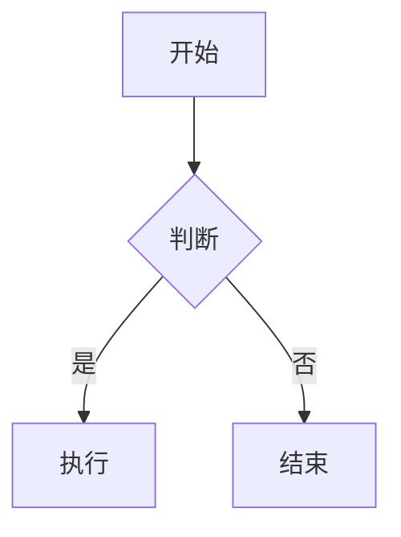

# Markdown 学习完全指南

Markdown 是一种轻量级标记语言，让你能用纯文本格式编写文档，然后转换成结构化的 HTML。它语法简单、易于阅读，广泛应用于写作、笔记、技术文档、论坛留言等场景。

---

## 目录

1. [基础语法](#基础语法)
   - 标题
   - 段落与换行
   - 强调
   - 列表
   - 链接与图片
   - 代码
   - 引用
   - 分隔线
2. [扩展语法（GFM）](#扩展语法gfm)
   - 表格
   - 任务列表
   - 删除线
   - 自动链接
   - 脚注
3. [高级技巧](#高级技巧)
   - 转义字符
   - 内嵌 HTML
   - 目录生成
   - 嵌入数学公式
   - 图表支持（Mermaid）
4. [实用建议](#实用建议)
5. [总结](#总结)

---

## 基础语法

### 标题

使用 `#` 号标记标题，`#` 的数量代表级别，从 1 到 6。

```markdown
# 一级标题
## 二级标题
### 三级标题
#### 四级标题
##### 五级标题
###### 六级标题
```

渲染效果：

# 一级标题
## 二级标题
### 三级标题
#### 四级标题
##### 五级标题
###### 六级标题

> **提示**：通常在 `#` 后加一个空格，某些编辑器不强制，但这是最佳实践。

### 段落与换行

段落之间用 **一个空行** 分隔。  
Markdown 中单个换行不会产生段落分隔，若要在段内换行，需在行末添加 **两个空格** 然后回车，或使用 `<br>` 标签。

```markdown
这是第一段。

这是第二段。
这是同一段的延续，  
这句话会换到下一行但仍在同一段落中。
```

渲染效果：

这是第一段。

这是第二段。
这是同一段的延续，  
这句话会换到下一行但仍在同一段落中。

### 强调

- **加粗**：`**文本**` 或 `__文本__`
- *斜体*：`*文本*` 或 `_文本_`
- ***加粗斜体***：`***文本***` 或 `___文本___`
- ~~删除线~~（扩展语法）：`~~文本~~`

```markdown
**这是加粗**  
*这是斜体*  
***这是加粗斜体***  
~~这是删除线~~
```

### 列表

#### 无序列表

使用 `-`、`*` 或 `+` 作为列表标记，后面跟一个空格。

```markdown
- 项目 1
- 项目 2
  - 嵌套项目 2.1
  - 嵌套项目 2.2
- 项目 3
```

#### 有序列表

使用数字加点号，如 `1.`，数字顺序不必严格递增，渲染时会自动递增。

```markdown
1. 第一步
2. 第二步
   1. 子步骤 2.1
   2. 子步骤 2.2
3. 第三步
```

渲染效果：

1. 第一步
2. 第二步
   1. 子步骤 2.1
   2. 子步骤 2.2
3. 第三步

> 列表嵌套时，子列表前加两个空格或一个制表符。

### 链接与图片

**链接**：`[显示文本](URL "可选标题")`

```markdown
[OpenAI](https://openai.com "点击访问 OpenAI")
```

**图片**：``

```markdown

```

渲染效果：  
[OpenAI](https://openai.com "点击访问 OpenAI")


> 图片无法加载时会显示替代文本。

### 代码

**行内代码**：用反引号包裹 `` `代码` ``。

```markdown
使用 `print("Hello")` 函数。
```

**代码块**：用三个反引号 ` ``` ` 或缩进四个空格。

````
```python
def hello():
    print("Hello, World!")
```
````

指定语言可启用语法高亮。

渲染效果：

```python
def hello():
    print("Hello, World!")
```

### 引用

使用 `>` 表示引用，可嵌套。

```markdown
> 这是一条引用。
> 
> > 这是嵌套引用。
> 
> 回到外层。
```

渲染效果：

> 这是一条引用。
>
> > 这是嵌套引用。
>
> 回到外层。

### 分隔线

使用三个或更多的 `*`、`-` 或 `_` 单独占一行。

```markdown
---
***
___
```

渲染效果相同，都是一条水平线。

---

## 扩展语法（GFM）

GitHub Flavored Markdown (GFM) 在基础语法上增加了许多实用功能，被绝大多数平台支持。

### 表格

使用管道符 `|` 和连字符 `-` 创建表格。

```markdown
| 姓名   | 年龄 | 职业     |
|--------|------|----------|
| 张三   | 28   | 工程师   |
| 李四   | 32   | 设计师   |
| 王五   | 25   | 教师     |
```

对齐方式：在分隔行使用冒号，左对齐 `:---`，右对齐 `---:`，居中 `:---:`。

```markdown
| 左对齐 | 居中对齐 | 右对齐 |
|:-------|:--------:|-------:|
| 内容   | 内容     | 内容   |
```

渲染效果：

| 左对齐 | 居中对齐 | 右对齐 |
| :----- | :------: | -----: |
| 内容   |   内容   |   内容 |

### 任务列表

用于创建可勾选的待办事项，在列表项前加 `[ ]` 或 `[x]`。

```markdown
- [ ] 未完成任务
- [x] 已完成任务
- [ ] 另一个任务
```

渲染效果：

- [ ] 未完成任务
- [x] 已完成任务
- [ ] 另一个任务

> 多数编辑器支持点击交互，但纯 Markdown 只显示复选框。

### 删除线

之前提到，用 `~~包裹~~` 表示 ~~删除线~~。

### 自动链接

用尖括号包裹 URL 或邮箱，会自动转换为可点击链接。

```markdown
<https://www.example.com>
<user@example.com>
```

### 脚注

GFM 和其他一些扩展支持脚注。

```markdown
这是一个需要脚注的句子[^1]。

[^1]: 这是脚注的内容。
```

渲染效果（在支持脚注的平台上）：

这是一个需要脚注的句子[^1]。

[^1]: 这是脚注的内容。

---

## 高级技巧

### 转义字符

使用反斜杠 `\` 对 Markdown 特殊字符进行转义，使其原样显示。

```markdown
\* 这不是斜体 \*
\# 这不是标题
```

可转义的字符：`\` `*` `_` `{}` `[]` `()` `#` `+` `-` `.` `!` `|` `~` 等。

### 内嵌 HTML

Markdown 支持直接插入 HTML 标签，用于实现 Markdown 语法不支持的功能，比如更改颜色、设置属性等。

```markdown
<span style="color:red;">这段文字是红色的</span>
<kbd>Ctrl</kbd> + <kbd>C</kbd>
```

渲染效果：  
<span style="color:red;">这段文字是红色的</span>  
<kbd>Ctrl</kbd> + <kbd>C</kbd>

> 注意：并非所有平台都允许内嵌 HTML，安全策略可能过滤标签。

### 目录生成

许多 Markdown 编辑器和平台（如 VS Code、Typora、GitHub Wiki）支持自动生成目录。  
通用做法是手动维护目录链接，如本文开头的目录，使用锚点跳转。

锚点规则：标题文本转小写，空格替换为 `-`，移除标点。  
例如 `## 我的标题 (示例)` -> `#我的标题-示例`。

### 嵌入数学公式

许多 Markdown 处理器支持 LaTeX 数学公式，使用 `$` 包裹行内公式，`$$` 包裹块级公式。

```markdown
行内公式：$E = mc^2$

块级公式：
$$
\sum_{i=1}^{n} x_i = x_1 + x_2 + \cdots + x_n
$$
```

需要渲染器支持（如 MathJax 或 KaTeX），常见平台（如 Typora、Jupyter Notebook、部分博客）均支持。

### 图表支持（Mermaid）

一些平台支持使用 Mermaid 语法直接在 Markdown 中创建流程图、时序图、甘特图等。

````markdown

````

渲染效果（取决于平台支持）：


---

## 实用建议

1. **保持简洁**：Markdown 设计初衷就是易读易写，避免过度使用嵌套和复杂 HTML。
2. **空行管理**：段落间用空行分隔，列表、代码块前后最好有空行，能提高兼容性。
3. **统一符号**：无序列表全用 `-`，加粗用 `**`，保持文档风格一致。
4. **利用编辑器预览**：Typora、VS Code、Obsidian 等提供实时预览，帮助及时发现格式错误。
5. **了解平台差异**：不同平台支持的扩展可能不同，写作前确认目标平台的支持情况（如 GitHub、GitLab、Reddit 等）。
6. **文档元数据**：在文档开头使用 YAML Front Matter（由 `---` 包裹）定义标题、标签等元数据，常见于静态网站生成器。

```markdown
---
title: "我的文档"
date: 2026-07-25
tags: ["markdown", "教程"]
---
```

---

## 总结

Markdown 是一种极简而强大的写作工具，掌握基础和常用扩展语法即可应对绝大多数场景。通过不断实践，你会发现它能让你的写作更专注、排版更高效。希望这份学习文档能帮助你快速上手，并在未来的写作中游刃有余。

*持续练习，享受纯文本写作的乐趣！*